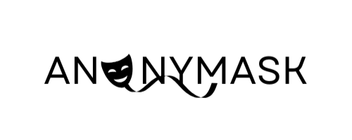

# 🎭 AnonyMask: Automated Masking and Unmasking of Explicit and Implicit Privacy Data

<p align="center" width="100">



</p>

[](https://www.apache.org/licenses/LICENSE-2.0)


<p align="justify"><b>AnonyMask</b> is a privacy-preserving tool designed to <b>automatically detect, mask, and unmask privacy data</b> across <b>various file formats</b>. It allows enterprises to leverage the power of Large Language Model (LLM) or Retrieval-Augmented Generation (RAG) while ensuring that private or confidential information remains secure and compliant. With a single click, users can anonymize both <b>explicit and implicit privacy data</b> before sending it to LLM or RAG for analysis—and restore the original content afterward using smart unmasking. AnonyMask offers a secure, customizable, and offline-capable privacy-preserving document compatible with common file types such as .pdf, .docx, .xlsx, .csv, and .txt.</p>

<br>

## 💡 Motivation Behind AnonyMask

<p align="justify">The rapid adoption of <b>AI in enterprise environments</b>—especially for customer insights, HR analytics, financial processing, and legal document summarization—has introduced <b>new privacy challenges</b>. Real-world cases demonstrate how users—ranging from medical staff inputting patient data into LLM to employees sharing proprietary code—can unintentionally expose sensitive information when interacting with LLM or RAG systems, leading to risks of data retention, leakage, and privacy violations.
 
Despite regulations such as <b>GDPR</b> and <b>UU PDP</b> in Indonesia, many users are unaware of what personal data gets extracted, how it's processed, and where it ends up. AnonyMask was created to address this gap by offering a <b>secure and automated masking system</b> before documents reach any LLM or RAG for analysis. It supports <b>explicit and implicit privacy data detection</b> and enables unmasking afterward—ensuring compliance, data protection, and peace of mind.</p>

<br>

## 🔐 Main Features

| No. | Main Features                     | Description |
|:---:|:----------------------------|:------------|
| 1.  | **Automatic Privacy Data Masking** | Detects and masks both **explicit** and **implicit ([33 labels](https://github.com/Caudrey/AnonyMask/blob/main/AnonyMaskLabels.txt))** privacy data using transformer-based AI models. |
| 2.  | **Multi-File Format Support**      | Supports input and output in **`.txt`, `.csv`, `.pdf`, `.docx`, `.xlsx`, and `.xls`** formats. |
| 3.  | **Secure LLM/RAG Integration**         | Prepares **privacy-safe documents**, ensuring no raw PII is exposed to external LLM or RAG. |
| 4.  | **Smart Unmasking**                | **Restores original content** after LLM or RAG processing using internal token mapping—seamlessly reversing the masked values. |
| 5.  | **Customizable Masking Rules**     | Allows users to define which entities to mask or exclude, offering **full control over the masking process**. |
| 6.  | **Privacy By Design**              | All processing is performed **offline and locally**—no data is sent or stored externally, ensuring full confidentiality. |
| 7.  | **Transparent Logging**            | Maintains **logs of all masking and unmasking operations** for traceability and auditability. |
| 8.  | **Multilingual Model Support**     | Automatically detects privacy data in **multiple languages** such as English and Indonesian using models like XLM-RoBERTa. |
| 9.  | **Portable Desktop Application**   | Runs as a **standalone `.exe`** without requiring external dependencies on the user’s machine. |

<br><br>

## 🧾 Your Privacy, Your Rules

| No. | Interface | Type                       | Description |
|:---:|:--------------|:---------------------------|:--------|
| 1.  | Masking       | **Redacted Masking**       | **Replaces all** with **`****`**, fully hiding the original content. |
|     |               | **Partial Masking**        | **Partially hides values**, showing only fragments (e.g., `J*** ***e`, `0*******1`) to retain readability. |
|     |               | **Full Masking – Category**| Replaces with its **category label** (e.g., `[Name]`, `[Email]`, `[DOB]`). |
|     |               | **Full Masking – Value**   | Replaces with **custom user input**. If not specified, it defaults to the category label. |
|     |               | **Full Masking – All Random** | Randomizes every privacy value **independently**, even if repeated data exists (e.g., `John → Axel`, next `John → Rey`). |
|     |               | **Full Masking – Same Random** | Randomizes data **consistently**, so identical inputs get the same output every time (e.g., `John → Axel`, all `John` remain `Axel`). |
| 2.  | Unmasking     | **Automatic Unmasking**    | **Restores original content** in the processed file using the token mapping log generated during masking. |

<br><br>


## ⚙️ Requirements
### 🔧 Production Mode
- Required Ports:
    - Port 4200 (Frontend - Angular)
    - Port 8000 (Backend - Python backend)
> [!NOTE]
> No manual installation needed – just run the .exe!

<br>

### 🧪 [OPTIONAL] Development Mode
- Python 3.x
- Node.js 
- Angular
- Rust
- Tauri CLI – install via:
```
cargo install tauri-cli
```

<br><br>

## 🚀 Deployment and Usage
### 🔧 Production Mode
1. **Download the `.exe` installer** from the link below.
    
    [AnonyMask Exe](https://github.com/Caudrey/AnonyMask/blob/main/ShadowMask/src-tauri/target/release/bundle/nsis/shadow-mask_0.1.0_x64-setup_shadowMaskFinal.exe)

2. **Run the installer** – it will automatically set up everything you need.
3.  **Run AnonyMask** — the app will:
    - Open the desktop UI
    - Run fully offline with the backend pre-configured

<br>

### 🧪 [OPTIONAL] Development Mode

1. Clone the Repository
``` 
git clone https://github.com/Caudrey/AnonyMask
cd ShadowMask
```
2. Install Angular Dependencies
```
npm install
npm install concurrently --save-dev
```
3. Run Both Frontend and Backend
```
cargo tauri dev
```

<br>

**ℹ️ Notes:**
- Run Angular UI at http://localhost:4200
- Run Python backend at http://127.0.0.1:8000

<br><br>

## 🖥️ Demo for Main Features

### 🔒 Masking File
| Input File | Choose Model | Choose Masking Option | Download Masked File |
| ---------------------------------------------------- | ---------------------------------------------------- | ---------------------------------------------------- | ---------------------------------------------------- |
|  File format: .txt, .csv, .pdf, .docx, .xlsx, and .xls |  Model: Explicit or Implicit|  Options: Redacted, Partial, Full Masking (Category, Value, All Random, Same Random) |  Output: Masked File and Mapping Log File

<br>

| Original File | Masked File | Mapping Log |
| ---------------------------------------------------- | ---------------------------------------------------- | ---------------------------------------------------- |
|   [Example Original File](https://github.com/Caudrey/AnonyMask/tree/main/ExampleFile/original_document) |  [Example Masked File](https://github.com/Caudrey/AnonyMask/tree/main/ExampleFile/masked_document) |  [Example Mapping Log File](https://github.com/Caudrey/AnonyMask/tree/main/ExampleFile/masking_log) | 

<br>

### 🔓 Unmasking File
| Input Mapping Log | Input Processed File | Download Unmasking Result |
|:---------:|:-----------------------:|:-----------------------:|
|  Use mapping log generated during masking (format: .json) |  File Format: .txt, .csv, .pdf, .docx, .xlsx, and .xls |  File will be automatically unmasked for download 


<br>

| Processed File | Unmasked File | 
| ---------------------------------------------------- | ---------------------------------------------------- |
|  [Example Processed File](https://github.com/Caudrey/AnonyMask/tree/main/ExampleFile/processed_masked_document) |  [Example Unmasked File](https://github.com/Caudrey/AnonyMask/tree/main/ExampleFile/unmasked_processed_file)| 


<br><br>


## 👤 Authors
- [Caudrey](https://github.com/Caudrey)
- [vincent-kartamulya](https://github.com/vincent-kartamulya)
- [nadyaclrp](https://github.com/nadyaclrp)
